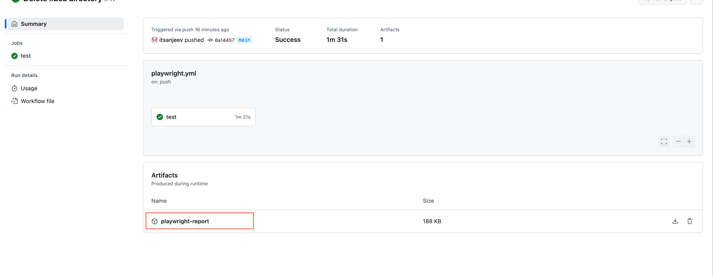
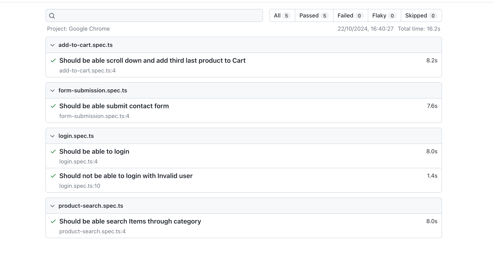

# automation-exercise [](https://github.com/itsanjeev/automation-exercise/actions/workflows/playwright.yml)

This repository contains automated end-to-end tests for the project, built using Playwright.

## Automated Test Scripts
The test scripts are written using Playwright and TypeScript. These scripts cover the end-to-end flow for key user functionalities of the application `https://automationexercise.com/`.

The tests include:
* **Login functionality**
* **Adding products to cart**
* **Contact form submission**
* **Product search**

## Framework Overview 
The project follows a layered architecture approach to organise the folder structure. Below is the directory structure:

* .github - This contains pipeline yml file
* config - This contains custom configuration file required to run the test
* pages - Implements the Page Object Model (POM) design pattern. Each page of the application has a corresponding class that encapsulates the page’s elements and behaviors, promoting better organization and reuse of code.
* test-data - This folder contains test data used for data-driven tests, allowing for easy updates and management of test inputs and expected results.
* test - Serves as the entry point for executing tests.
* playwright.config - The default configuration file for Playwright, where you can specify browser settings, timeouts, and other global options.
* package.json - This file contains the project's dependencies, scripts, and metadata necessary for Node.js package management.
* yarn.lock: This lock file ensures that the same dependency versions are installed across different environments, providing consistency in builds.

**Test Layer** 
```ts
import {test} from "../config/base-fixture"
import {expect} from "@playwright/test";

test('Should be able to login', async ({pageManager, userLoginTestdata}) => {
    await pageManager.loginPage.goTo();
    await pageManager.loginPage.login(userLoginTestdata.HappyPath.username, userLoginTestdata.HappyPath.password)
    expect(await pageManager.loginPage.isUserLoggedIn()).toBe(true);
})
```
**Page Layer**
Page manager 
```ts
export default class PageManager {
    private readonly page: Page;

    private _loginPage: LoginPage | null = null;
    constructor(page: Page) {
        this.page = page;
    }

    public get loginPage() {
        if (!this._loginPage) {
            this._loginPage = new LoginPage(this.page);
        }
        return this._loginPage;
    }
    
}
```
Page Class 
```ts
export default class LoginPage extends BasePage {

    protected get usernameInput() {
        return this.page.locator('form').filter({hasText: 'Login'}).getByPlaceholder('Email Address')
    }

    protected get passwordInput() {
        return this.page.locator('form').filter({hasText: 'Login'}).getByPlaceholder('Password')
    }

    protected get loginBtn() {
        return this.page.getByRole('button', {name: 'Login'})
    }
    
    constructor(page: Page) {
        super(page)
    }

    async goTo() {
        await this.page.goto("/login")
    }

    async login(username: string, password: string) {
        await this.usernameInput.fill(username)
        await this.passwordInput.fill(password)
        await this.loginBtn.click()
    }

}
```


## Steps for Setting Up the Project Locally and Running Tests

### Prerequisites:

* Node.js (version >=16.x.x)
* Yarn (for package management)

### Setup Instructions:

1. Clone the Repository:

```bash 
git clone https://github.com/itsanjeev/automation-exercise.git
```
and navigate to the folder:
```bash
cd automation-exercise
```
2. Install Dependencies: Install the necessary dependencies, including Playwright browsers, using the following commands:

```bash
yarn install
yarn playwright install --with-deps
```
3. Running Tests locally: Execute the Playwright tests with the following command:

```bash
yarn run:local
```
4. Generating Reports: Playwright generates HTML reports by default. After running the tests, you can view the report using:
```bash
yarn playwright show-report
```

## Pipeline Setup Steps and How to Access Reports

**CI Pipeline Setup**:

This project is configured to use GitHub Actions for Continuous Integration (CI). The pipeline is automatically triggered on every push to the main branch.

* **CI Configuration File**: The GitHub Actions configuration file is located at:
```
.github/workflows/playwright.yml
```

**Key Steps in the Pipeline:**
1. **Checking out the code**: This ensures the repository code is checked out into the GitHub Actions runner.
2. **Setting up Node.js**: The pipeline uses the actions/setup-node GitHub Action to set the Node.js version.
3. **Installing dependencies**: Installs all Node.js dependencies using yarn.
4. **Installing Playwright browsers**: This installs the required browsers with Playwright.
5. **Running the Playwright tests**: Executes the Playwright tests using the yarn playwright test command.
6. **Uploading the test results**: Once tests are complete, the test results and reports are uploaded as artifacts for later review.

**Accessing CI Reports**:
Once the tests have run, the report is automatically generated and stored in the **playwright-report** folder. You can download the Playwright HTML report from the GitHub Actions workflow.

To access reports:
1. Navigate to the Actions tab in this GitHub repository.
2. Select the workflow run you want to see the result.
3. Under the Artifacts section, download the playwright-report folder.
4. Download and Extract the folder and open the HTML report to view the detailed test results.



**HTML Report**:

